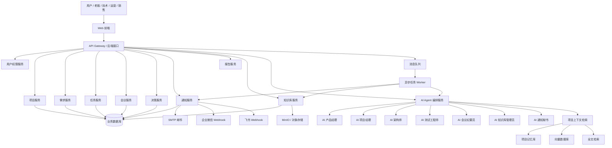
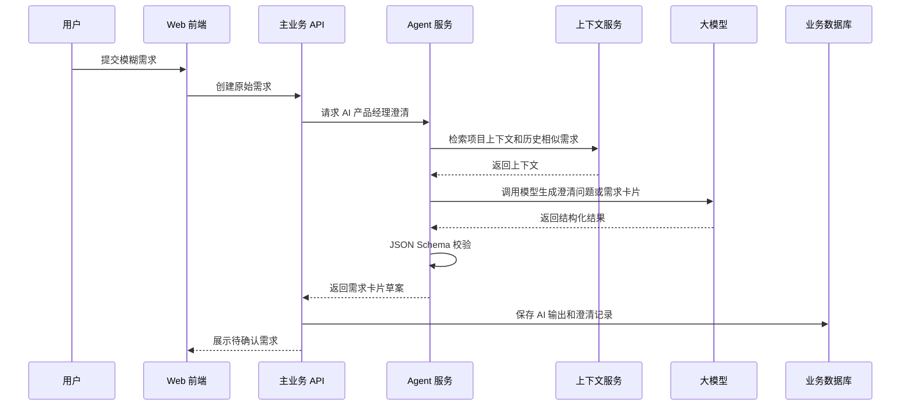
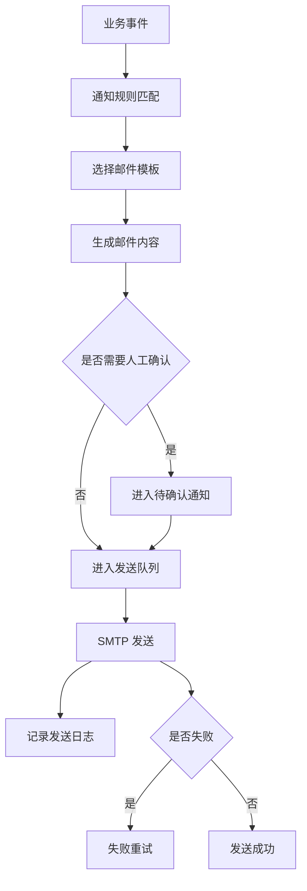
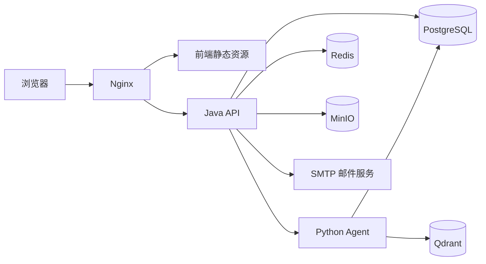

# AI 企业大脑平台：项目架构设计文档 v1.0

> 本文档基于《AI 企业大脑平台：系统 SPEC 规划文档 v1.0》编写，用于指导后端、前端、AI Agent 服务、数据库、通知、知识库和部署的工程落地。本文档的目标是让开发团队能够根据 SPEC 构建一个可运行、可扩展、可持续演进的 AI 企业协作平台。

> **【技术栈更新】** 本平台已确定统一采用 **方案A：统一 TypeScript 全栈**（Next.js 15 + React 19 + TypeScript + Tailwind/shadcn + Prisma + PostgreSQL/pgvector + Vercel AI SDK + Auth.js + BullMQ，统一走 AgentLLM 网关）。文中早期的多语言实现建议（Vue/Java/Python）已被取代；**权威落地说明见《AI企业大脑平台_04_技术栈落地说明.md》**。本文的分层架构、业务服务职责、数据模型、事件流、通知与安全设计依然有效，只是落地语言/框架统一为 TypeScript。

---

## 1. 架构目标

AI 企业大脑平台的架构目标不是简单实现一个任务管理系统，而是构建一个支持多 AI 员工协同、项目上下文记忆、需求治理、任务推进、通知提醒和知识沉淀的企业级智能工作中台。

架构必须满足以下目标：

1. 支持“项目空间 → 需求澄清 → 需求卡片 → 任务拆解 → 看板推进 → 通知提醒 → 知识沉淀”的核心闭环。
2. 支持多个 AI 员工按职责分工执行任务。
3. 支持每个项目拥有独立上下文和长期记忆。
4. 支持人类在关键节点进行确认和审批。
5. 支持邮件、站内信、企业微信、飞书等通知渠道扩展。
6. 支持后续接入 GitLab、禅道、Jira、飞书文档、企业知识库等外部系统。
7. 支持多项目、多角色、多权限的数据隔离。
8. 支持 AI 输出结构化落库，而不是只停留在聊天文本。

---

## 2. 总体架构

### 2.1 分层架构

```text
用户访问层
  - Web 管理端
  - 后续可扩展移动端 / 企业微信入口 / 飞书入口

前端应用层
  - 工作台
  - 项目空间
  - AI 对话区
  - 需求管理
  - 任务看板
  - 通知中心
  - 知识库
  - AI 员工管理

业务服务层
  - 用户权限服务
  - 项目服务
  - 需求服务
  - 任务服务
  - 评审服务
  - 会议服务
  - 决策服务
  - 报告服务
  - 通知服务
  - 集成服务

AI 服务层
  - Agent 编排服务
  - AI 员工服务
  - Prompt 模板服务
  - 上下文检索服务
  - 结构化输出解析服务
  - 工具调用服务
  - AI 调用审计服务

知识与记忆层
  - 项目记忆服务
  - 企业知识库服务
  - 文档解析服务
  - 向量检索服务
  - 全文检索服务

数据与基础设施层
  - 关系型数据库
  - Redis
  - 向量数据库
  - 对象存储
  - 消息队列
  - 搜索引擎
  - 日志和监控
```

---

### 2.2 架构图



---

## 3. 推荐技术栈

> 落地决策：统一采用 **方案A（统一 TypeScript 全栈，单 Next.js 应用）**。下表为实际采用技术；详见《AI企业大脑平台_04_技术栈落地说明.md》。原多语言（Vue/Java/Python）方案不再采用。

### 3.1 前端 / 全栈框架

| 类型 | 技术 |
|---|---|
| 框架 | Next.js 15（App Router）+ React 19 |
| 语言 | TypeScript（strict） |
| 样式 | Tailwind CSS v4 |
| UI 组件 | shadcn/ui（new-york, neutral） |
| 图标 | lucide-react |
| 状态管理 | React Server Components 优先 + 轻量 client state |
| 看板拖拽 | dnd-kit |
| Markdown/富文本 | react-markdown / Tiptap |
| 图表 | Recharts / ECharts |
| 流程图 | Mermaid |

### 3.2 后端（同一 Next.js 应用内，无独立 Java 服务）

| 类型 | 技术 |
|---|---|
| 运行形态 | Next.js Route Handlers + Server Actions（单体全栈 TS） |
| ORM | Prisma |
| 认证/权限 | Auth.js (next-auth v5) + RBAC + 项目级权限 |
| 异步任务/调度 | BullMQ + ioredis |
| 缓存 | Redis |
| 校验 | zod |

### 3.3 AI 服务（库内模块，暂不独立部署）

| 类型 | 技术 |
|---|---|
| AI SDK | Vercel AI SDK v6（ai / @ai-sdk/openai-compatible / @ai-sdk/react） |
| LLM 网关 | AgentLLM（OpenAI 兼容，统一 base_url + key） |
| Agent 编排 | 库内 Agent 注册表 + 工具调用（src/lib/ai/*）；复杂后再抽独立服务 |
| 结构化输出 | generateObject + zod schema |
| 向量化 | text-embedding-3-large（降维 1536） |
| 文档解析 | TS 方案（unpdf / officeparser 等） |

### 3.4 数据和基础设施

| 类型 | 技术 |
|---|---|
| 关系数据库 | PostgreSQL |
| 向量检索 | pgvector（与主库同库） |
| 全文检索 | PostgreSQL FTS |
| 对象存储 | MinIO（S3 兼容） |
| 部署 | Docker Compose（本地）/ Vercel / 后续 K8s |
| 监控 | 可选接入 Sentry / Prometheus |

---

## 4. 服务拆分设计

### 4.1 MVP 阶段服务拆分

MVP 不建议一开始过度微服务化。建议采用“主业务单体 + 独立 AI 服务 + 异步 Worker”的方式。

```text
ai-brain-web         前端项目
ai-brain-api         Java 主业务服务
ai-brain-agent       Python AI Agent 服务
ai-brain-worker      异步任务服务，可先合并在 api 或 agent 内
postgres/mysql       业务数据库
redis                缓存和任务状态
qdrant/pgvector      向量检索
minio                附件和文档存储
nginx                反向代理
```

### 4.2 v1.0 后可拆分服务

后续用户量、数据量和 AI 调用量增加后，再拆为：

```text
user-service
project-service
requirement-service
task-service
workflow-service
notification-service
knowledge-service
agent-service
integration-service
report-service
audit-service
```

---

## 5. 核心业务服务设计

## 5.1 用户权限服务

职责：

- 用户登录、退出、刷新 Token。
- 用户、角色、权限管理。
- 公司、部门、项目成员关系管理。
- 项目级、文档级、知识库级数据权限控制。
- AI 员工工具权限控制。

核心对象：

```text
User
Role
Permission
Department
ProjectMember
UserRole
RolePermission
```

权限模型：

```text
RBAC 为基础：用户 → 角色 → 权限。
项目级权限补充：用户在不同项目中可以有不同角色。
AI 权限补充：AI 员工只能访问授权项目、授权知识库、授权工具。
```

---

## 5.2 项目服务

职责：

- 创建和管理项目空间。
- 维护项目目标、业务背景、成员、状态、周期。
- 聚合项目需求、任务、会议、决策、风险、知识和 AI 对话。
- 提供项目总览数据。

核心接口：

```http
POST   /api/projects
GET    /api/projects
GET    /api/projects/{id}
PUT    /api/projects/{id}
DELETE /api/projects/{id}
GET    /api/projects/{id}/dashboard
GET    /api/projects/{id}/context
POST   /api/projects/{id}/members
DELETE /api/projects/{id}/members/{userId}
```

---

## 5.3 需求服务

职责：

- 管理原始想法、需求池、标准需求卡片。
- 支持 AI 澄清结果落库。
- 支持需求评审、状态流转、变更记录。
- 关联任务、会议、决策、文档和知识。

核心接口：

```http
POST   /api/requirements
GET    /api/requirements
GET    /api/requirements/{id}
PUT    /api/requirements/{id}
POST   /api/requirements/{id}/clarify
POST   /api/requirements/{id}/review
POST   /api/requirements/{id}/confirm
POST   /api/requirements/{id}/split
POST   /api/requirements/{id}/merge
GET    /api/requirements/{id}/history
```

需求状态流：

```text
想法池 → 待澄清 → 待评审 → 已确认 → 待排期 → 开发中 → 测试中 → 待验收 → 已上线 → 已归档
```

---

## 5.4 任务服务

职责：

- 管理任务卡片。
- 支持 AI 从需求自动拆解任务。
- 支持任务分配、状态变更、阻塞反馈、工时记录。
- 支持看板拖拽和进度统计。

核心接口：

```http
POST   /api/tasks
GET    /api/tasks
GET    /api/tasks/{id}
PUT    /api/tasks/{id}
POST   /api/tasks/{id}/status
POST   /api/tasks/{id}/block
POST   /api/tasks/{id}/complete
POST   /api/requirements/{id}/generate-tasks
GET    /api/projects/{id}/kanban
```

任务状态流：

```text
待开始 → 进行中 → 待联调 → 待测试 → 待验收 → 已完成
```

异常状态：阻塞中、延期中、已取消。

---

## 5.5 评审服务

职责：

- 管理需求评审、技术评审、上线评审。
- 保存评审意见和结论。
- 支持 AI 生成评审建议。
- 评审结果驱动需求状态变化。

核心对象：

```text
Review
ReviewParticipant
ReviewComment
ReviewResult
```

评审结果：

```text
通过
退回补充
延期处理
合并到已有需求
拆分为多个需求
拒绝
```

---

## 5.6 会议服务

职责：

- 管理会议记录。
- 支持上传会议录音、文本、附件。
- 调用 AI 会议纪要员生成纪要。
- 提取任务、决策、风险、需求变更。
- 关联项目和需求。

核心接口：

```http
POST   /api/meetings
GET    /api/meetings
GET    /api/meetings/{id}
POST   /api/meetings/{id}/summarize
POST   /api/meetings/{id}/extract-actions
POST   /api/meetings/{id}/link-project
```

---

## 5.7 决策服务

职责：

- 记录项目关键决策。
- 关联项目、需求、任务、会议。
- 支持 AI 从会议和评审中提取决策。
- 支持决策确认和变更。

核心接口：

```http
POST   /api/decisions
GET    /api/decisions
GET    /api/decisions/{id}
PUT    /api/decisions/{id}
POST   /api/decisions/{id}/confirm
GET    /api/projects/{id}/decisions
```

---

## 5.8 通知服务

职责：

- 管理站内信、邮件、企业微信、飞书等通知。
- 根据事件触发通知。
- 支持通知模板、通知规则、发送队列、失败重试、发送日志。
- 支持未读、已读、确认状态。

通知渠道：

```text
站内信
邮件 SMTP
企业微信 Webhook
飞书 Webhook
Webhook 扩展
```

核心接口：

```http
POST   /api/notifications/send
GET    /api/notifications
POST   /api/notifications/{id}/read
POST   /api/notification-rules
GET    /api/notification-rules
PUT    /api/notification-rules/{id}
```

---

## 5.9 知识库服务

职责：

- 管理项目知识、业务知识、技术知识、FAQ。
- 支持文档上传、解析、分块、向量化、检索。
- 支持 AI 知识库管理员自动归档项目资料。
- 支持问答式检索。

核心接口：

```http
POST   /api/knowledge/docs
GET    /api/knowledge/docs
GET    /api/knowledge/docs/{id}
POST   /api/knowledge/docs/{id}/parse
POST   /api/knowledge/search
POST   /api/knowledge/qa
POST   /api/projects/{id}/knowledge/archive
```

---

## 5.10 项目记忆服务

职责：

- 管理项目短期记忆、工作记忆、长期记忆、组织记忆。
- 从需求、任务、会议、决策、报告、知识中自动生成记忆。
- 为 AI Agent 提供上下文检索能力。

记忆类型：

```text
项目背景记忆
业务规则记忆
历史需求记忆
历史决策记忆
技术架构记忆
人员分工记忆
客户反馈记忆
风险问题记忆
上线记录记忆
```

核心接口：

```http
POST   /api/memories
GET    /api/projects/{id}/memories
POST   /api/projects/{id}/memories/search
POST   /api/projects/{id}/memories/rebuild
```

---

## 6. AI Agent 服务设计

### 6.1 Agent 服务定位

Agent 服务独立部署，负责 AI 员工调度、上下文检索、Prompt 拼装、模型调用、工具执行、结构化输出解析和审计记录。

### 6.2 Agent 执行流程



---

### 6.3 Agent 编排器

Agent 编排器负责判断当前请求应该由哪个 AI 员工处理。

输入：

```json
{
  "project_id": 1,
  "user_id": 1001,
  "intent": "clarify_requirement",
  "raw_input": "我想做一个客户工单智能分析功能",
  "context_scope": ["project", "requirements", "decisions", "knowledge"]
}
```

输出：

```json
{
  "agent_role": "ai_product_manager",
  "action": "clarify_requirement",
  "requires_human_approval": true,
  "result_type": "requirement_draft"
}
```

---

### 6.4 AI 员工配置模型

```json
{
  "name": "AI 产品经理",
  "role_type": "ai_product_manager",
  "description": "负责需求澄清和 PRD 生成",
  "tools": ["context_search", "requirement_create", "similar_requirement_search"],
  "knowledge_scope": ["project_memory", "business_knowledge", "historical_requirements"],
  "requires_human_approval": true,
  "output_schema": "RequirementDraftSchema"
}
```

---

### 6.5 Prompt 模板管理

Prompt 不允许直接写死在代码中，应存入数据库，支持版本化。

字段：

```text
prompt_id
agent_role
name
version
system_prompt
user_prompt_template
output_schema
status
created_by
created_at
updated_at
```

Prompt 模板必须包含：

1. AI 员工角色定义。
2. 工作职责边界。
3. 当前项目上下文。
4. 当前输入内容。
5. 输出格式要求。
6. 不确定时必须提出待确认问题。
7. 禁止编造项目中不存在的信息。

---

### 6.6 结构化输出规范

所有 AI 输出必须尽量结构化，以便落库。

需求卡片输出示例：

```json
{
  "title": "客户工单智能分析",
  "background": "当前客服工单数量增加，人工分类效率低",
  "target_user": "客服人员、运营负责人",
  "business_goal": "提升工单分类效率，识别高优先级问题",
  "scope": ["工单自动分类", "情绪识别", "优先级判断", "统计报表"],
  "out_of_scope": ["自动派单", "自动回复客户"],
  "acceptance_criteria": [
    "支持按问题类型分类",
    "支持识别紧急工单",
    "后台可查看分析报表"
  ],
  "priority": "P1",
  "questions": []
}
```

---

## 7. 上下文与记忆架构

### 7.1 上下文来源

AI 员工处理任务时，需要检索以下内容：

```text
项目基础信息
项目目标和业务背景
历史需求
历史任务
历史决策
会议纪要
技术方案
接口文档
知识库文档
客户反馈
人员分工
项目风险
```

### 7.2 记忆分层

```text
短期记忆：当前对话、当前会议、当前需求讨论。
工作记忆：当前迭代、本周任务、阻塞和风险。
长期记忆：项目目标、业务规则、历史决策、技术架构。
组织记忆：公司流程、人员职责、业务线关系、客户背景。
```

### 7.3 检索策略

AI Agent 上下文检索采用组合策略：

```text
1. 结构化条件检索：按 project_id、requirement_id、task_id 查询数据库。
2. 全文检索：按关键词检索文档和会议。
3. 向量检索：按语义检索相似需求、相似决策和知识库片段。
4. 时间权重：近期内容优先，但长期决策不可忽略。
5. 重要性权重：高重要性记忆优先。
```

### 7.4 上下文组装

Agent 请求模型前应拼接：

```text
系统角色提示
当前项目摘要
当前用户输入
相关历史需求
相关决策记录
相关知识库片段
当前任务或需求状态
输出格式约束
```

上下文必须有 Token 限制策略：

```text
优先保留当前对象信息。
其次保留最近相关记录。
再保留高重要性长期记忆。
低相关内容只保留摘要。
```

---

## 8. 数据库设计

### 8.1 核心表清单

```text
sys_user
sys_role
sys_permission
sys_user_role
project
project_member
requirement
task
review
review_comment
meeting
decision
memory
knowledge_doc
knowledge_chunk
agent_employee
agent_prompt
agent_call_log
notification
notification_rule
operation_log
file_asset
```

---

### 8.2 Project 表

```sql
CREATE TABLE project (
    id BIGSERIAL PRIMARY KEY,
    project_code VARCHAR(64) NOT NULL UNIQUE,
    name VARCHAR(255) NOT NULL,
    description TEXT,
    business_background TEXT,
    goal TEXT,
    owner_id BIGINT,
    tech_owner_id BIGINT,
    product_owner_id BIGINT,
    status VARCHAR(32) NOT NULL DEFAULT 'planning',
    priority VARCHAR(16) DEFAULT 'P2',
    start_date DATE,
    end_date DATE,
    created_by BIGINT,
    created_at TIMESTAMP DEFAULT CURRENT_TIMESTAMP,
    updated_at TIMESTAMP DEFAULT CURRENT_TIMESTAMP
);
```

### 8.3 Requirement 表

```sql
CREATE TABLE requirement (
    id BIGSERIAL PRIMARY KEY,
    requirement_code VARCHAR(64) NOT NULL UNIQUE,
    project_id BIGINT NOT NULL,
    title VARCHAR(255) NOT NULL,
    type VARCHAR(64),
    source VARCHAR(64),
    original_content TEXT,
    background TEXT,
    problem TEXT,
    target_user TEXT,
    business_goal TEXT,
    scope TEXT,
    out_of_scope TEXT,
    user_story TEXT,
    acceptance_criteria TEXT,
    priority VARCHAR(16) DEFAULT 'P2',
    urgency VARCHAR(16),
    expected_online_time TIMESTAMP,
    owner_id BIGINT,
    status VARCHAR(32) NOT NULL DEFAULT 'idea_pool',
    created_by BIGINT,
    created_at TIMESTAMP DEFAULT CURRENT_TIMESTAMP,
    updated_at TIMESTAMP DEFAULT CURRENT_TIMESTAMP
);
```

### 8.4 Task 表

```sql
CREATE TABLE task (
    id BIGSERIAL PRIMARY KEY,
    task_code VARCHAR(64) NOT NULL UNIQUE,
    project_id BIGINT NOT NULL,
    requirement_id BIGINT,
    title VARCHAR(255) NOT NULL,
    description TEXT,
    task_type VARCHAR(64),
    assignee_id BIGINT,
    status VARCHAR(32) NOT NULL DEFAULT 'todo',
    priority VARCHAR(16) DEFAULT 'P2',
    start_time TIMESTAMP,
    due_time TIMESTAMP,
    estimated_hours NUMERIC(10,2),
    actual_hours NUMERIC(10,2),
    blocked_reason TEXT,
    acceptance_criteria TEXT,
    created_by BIGINT,
    created_at TIMESTAMP DEFAULT CURRENT_TIMESTAMP,
    updated_at TIMESTAMP DEFAULT CURRENT_TIMESTAMP
);
```

### 8.5 Memory 表

```sql
CREATE TABLE memory (
    id BIGSERIAL PRIMARY KEY,
    project_id BIGINT,
    memory_type VARCHAR(64) NOT NULL,
    title VARCHAR(255),
    content TEXT NOT NULL,
    source_type VARCHAR(64),
    source_id BIGINT,
    importance_score NUMERIC(5,2) DEFAULT 0,
    validity_status VARCHAR(32) DEFAULT 'valid',
    tags TEXT,
    embedding_id VARCHAR(128),
    created_at TIMESTAMP DEFAULT CURRENT_TIMESTAMP,
    updated_at TIMESTAMP DEFAULT CURRENT_TIMESTAMP
);
```

### 8.6 Notification 表

```sql
CREATE TABLE notification (
    id BIGSERIAL PRIMARY KEY,
    notification_type VARCHAR(64) NOT NULL,
    channel VARCHAR(32) NOT NULL,
    title VARCHAR(255) NOT NULL,
    content TEXT NOT NULL,
    receiver_id BIGINT,
    receiver_email VARCHAR(255),
    project_id BIGINT,
    requirement_id BIGINT,
    task_id BIGINT,
    status VARCHAR(32) DEFAULT 'pending',
    send_time TIMESTAMP,
    read_time TIMESTAMP,
    fail_reason TEXT,
    created_at TIMESTAMP DEFAULT CURRENT_TIMESTAMP
);
```

---

## 9. 事件与异步任务设计

### 9.1 事件类型

平台中重要动作应发布领域事件：

```text
RequirementCreated
RequirementClarified
RequirementConfirmed
RequirementRejected
TaskCreated
TaskAssigned
TaskBlocked
TaskDueSoon
TaskDelayed
TaskCompleted
MeetingSummarized
DecisionCreated
RiskDetected
WeeklyReportGenerated
KnowledgeArchived
NotificationRequested
```

### 9.2 事件流示例

需求确认后：

```text
RequirementConfirmed
  → AI 架构师分析技术影响
  → AI 项目经理拆解任务
  → 创建任务草案
  → 通知项目负责人确认任务
  → 任务确认后通知负责人
  → 生成项目记忆
```

任务延期后：

```text
TaskDelayed
  → AI 项目经理生成延期原因分析
  → 通知任务负责人
  → 通知项目负责人
  → 更新项目风险
  → 写入项目周报素材
```

---

## 10. 通知架构设计

### 10.1 通知触发方式

```text
业务事件触发
定时任务触发
人工手动触发
AI Agent 判断触发
```

### 10.2 邮件服务流程



### 10.3 邮件配置

配置项：

```text
smtp_host
smtp_port
smtp_username
smtp_password
smtp_ssl_enabled
sender_name
sender_email
retry_count
retry_interval
```

### 10.4 通知模板

邮件模板变量：

```text
${projectName}
${requirementTitle}
${taskTitle}
${assigneeName}
${dueTime}
${status}
${actionUrl}
${aiSummary}
```

---

## 11. 前端架构设计

### 11.1 页面分层

```text
Layout 层
  - 登录布局
  - 主应用布局
  - 项目空间布局

Page 层
  - 工作台
  - 项目列表
  - 项目详情
  - 需求管理
  - 任务看板
  - AI 对话
  - 会议管理
  - 决策记录
  - 知识库
  - 通知中心
  - AI 员工管理
  - 系统设置

Component 层
  - 项目卡片
  - 需求卡片
  - 任务卡片
  - 看板列
  - AI 对话框
  - 文档编辑器
  - 通知面板
  - 状态标签
  - 成员选择器
```

### 11.2 前端目录建议

```text
src/
  api/
  assets/
  components/
  layouts/
  router/
  stores/
  utils/
  views/
    dashboard/
    project/
    requirement/
    task/
    agent/
    knowledge/
    notification/
    setting/
```

---

## 12. 安全设计

### 12.1 权限安全

- 所有 API 必须校验用户身份。
- 项目相关数据必须校验项目成员权限。
- AI 员工调用工具前必须校验工具权限。
- 关键操作需要审计日志。

### 12.2 AI 安全

- AI 不允许绕过权限读取数据。
- AI 不允许直接执行高风险操作，例如删除项目、批量发送邮件、修改最终状态，除非人工确认。
- Prompt 中必须明确禁止编造数据。
- 对用户上传文档做 Prompt Injection 检测和隔离。
- AI 输出必须经过 Schema 校验和敏感词检查。

### 12.3 数据安全

- 密码加密存储。
- SMTP 密码等配置加密存储。
- 操作日志不可随意删除。
- 文档访问需要权限校验。
- 后续支持数据备份和恢复。

---

## 13. 部署架构

### 13.1 MVP Docker Compose 部署

```text
nginx
ai-brain-web
ai-brain-api
ai-brain-agent
postgres
redis
qdrant
minio
```

### 13.2 部署拓扑



### 13.3 环境变量示例

```env
APP_ENV=prod
DB_HOST=postgres
DB_PORT=5432
DB_NAME=ai_brain
DB_USER=ai_brain
DB_PASSWORD=******
REDIS_HOST=redis
REDIS_PORT=6379
QDRANT_URL=http://qdrant:6333
MINIO_ENDPOINT=http://minio:9000
SMTP_HOST=smtp.example.com
SMTP_PORT=465
SMTP_USERNAME=notice@example.com
SMTP_PASSWORD=******
AGENT_SERVICE_URL=http://ai-brain-agent:8000
```

---

## 14. 日志、监控和审计

### 14.1 日志类型

```text
业务操作日志
AI 调用日志
通知发送日志
接口访问日志
异常日志
权限拒绝日志
```

### 14.2 AI 调用日志字段

```text
agent_role
project_id
user_id
input_summary
context_refs
model_name
token_usage
output_summary
success
error_message
created_at
```

### 14.3 监控指标

```text
接口响应时间
AI 响应时间
AI 调用成功率
邮件发送成功率
任务队列积压数量
数据库连接数
CPU / 内存 / 磁盘
```

---

## 15. MVP 实施路线

### 阶段一：基础框架

- 用户登录和权限。
- 项目创建和项目空间。
- 需求录入。
- 基础数据库和接口。

### 阶段二：AI 产品经理闭环

- Agent 服务搭建。
- 项目上下文检索。
- AI 需求澄清。
- 标准需求卡片生成。
- 人工确认。

### 阶段三：任务和看板

- 需求转任务。
- AI 任务拆解。
- 任务分配。
- 任务看板。
- 任务状态流转。

### 阶段四：通知和报告

- 站内信。
- SMTP 邮件。
- 通知规则。
- 项目周报。
- 到期和延期提醒。

### 阶段五：记忆和知识库

- 项目记忆表。
- 需求、任务、决策自动沉淀。
- 文档上传和向量化。
- 项目大脑问答。

---

## 16. 架构落地建议

第一版不要追求所有 AI 员工完全自动化。建议先让 AI 产品经理跑通“模糊需求 → 需求卡片”的价值闭环，再逐步扩展 AI 项目经理、AI 架构师、AI 测试和 AI 通知秘书。

最小可用落地顺序：

```text
项目空间
  ↓
需求池
  ↓
AI 需求澄清
  ↓
需求卡片
  ↓
任务拆解
  ↓
任务看板
  ↓
邮件通知
  ↓
项目记忆
```

只要这条链路跑通，平台就具备区别于传统项目管理工具的核心价值。
